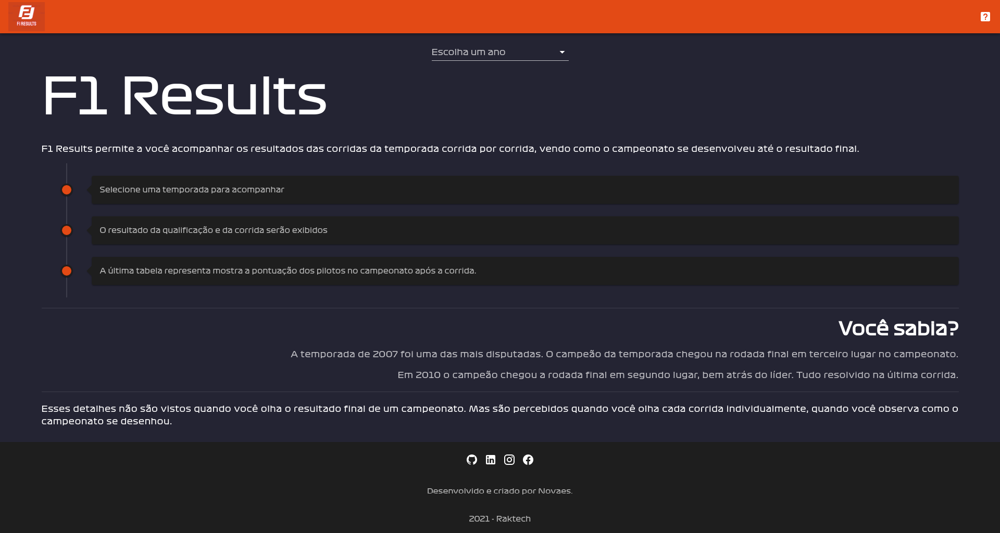
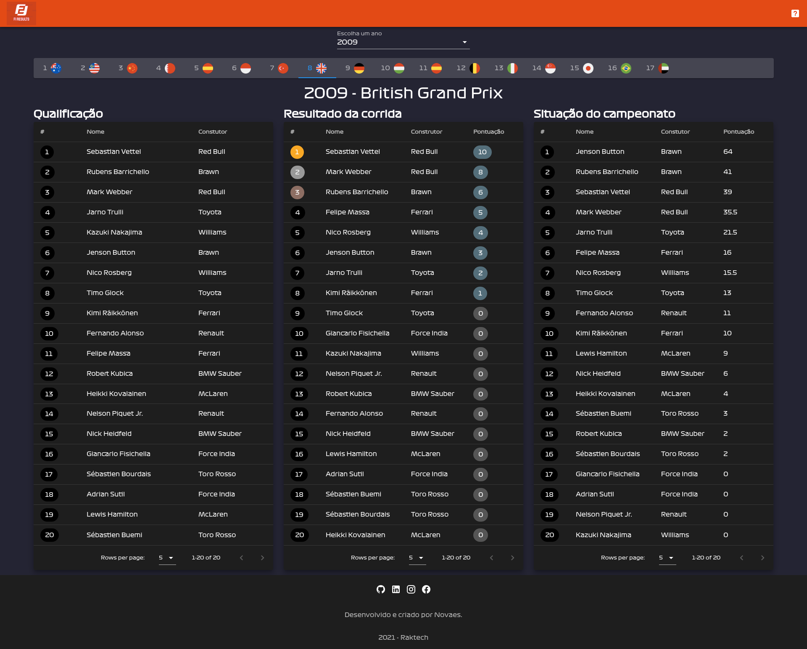
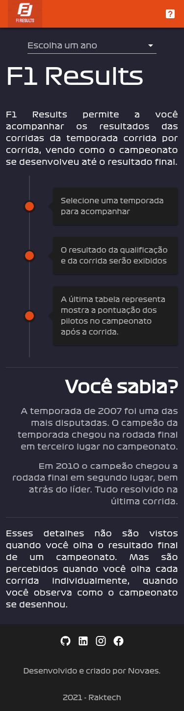

# f1results

F1 Results permite a você acompanhar os resultados das corridas da temporada corrida por corrida, vendo como o campeonato se desenvolveu até o resultado final.

* Selecione uma temporada para acompanhar
* O resultado da qualificação e da corrida serão exibidos
* A última tabela mostra a pontuação dos pilotos no campeonato após a corrida.

## :clipboard: Sumário

- [Visão Geral](#visao-geral)
  - [O problema](#o-problema)
  - [Prints](#prints)
  - [Links](#links)
- [Meu processo](#meu-processo)
  - [Construção](#construcao)
  - [O que aprendi](#o-que-aprendi)
- [Futuras implementações](#futuras-implementacoes)
- [Como executar o projeto](#como-executar-o-projeto)
- [Autor](#autor)

## :telescope: Visão geral

### O problema

Sou apaixonado por Fórmula 1. E a época de steaming em que vivemos nos permitiu ter conteúdo sob demanda e isso chegou para o esporte também.  
  
A plataforma de Steaming F1TV foi algo que assinei sem demora. Porém, como um fã hardcore que gosta de estudar os detalhes e estatísicas, eu achei que faltava muita informação ao selecionar uma corrida para assistir.  
  
Na época a plataforma apenas abria um player de vídeo para exibir a corrida. E com todo o espaço vazio na tela me veio a ideia e a pergunta de por que não colocar dados referentes aquela corrida, como a ordem do grid de largada, o resultado completo da corrida, a situação do campeonato antes e após da corrida. Esse tipo de informação nos faria ter uma visão mais geral do campeonato, além de proporcionar uma experiência mais imersiva.  
  
### Prints  
  
  
  
  
    
Não há print para um resultado mobile devido ao tamanho da imagem. Mas o projeto está responsivo e amigável para dispositivos móveis.
### Links
 
- Projeto online: [Netlify](https://infallible-thompson-af8456.netlify.app/)  
  
## :pencil2: Meu processo 
  
### Construção  
  
- Frontend:  
  - VueJs 
  - Vue-Router
  - Vuex
  - Vuetify
- Backend: 
  - [Ergast API](http://ergast.com/mrd/)

### O que aprendi

Estou constantemente refatorando esse projeto a medida que aprendo mais sobre Vue.  

Entendi como o ciclo de vida dos componentes funciona e como devo usá-los para extrair o máximo da reatividade que o Vue oferece.  
  
Aprendi sobre o uso de eventos. Logo depois vi como essa abordagem deve ser evitada. Dessa forma aprendi sobre Vuex e mudei completamente a forma como o projeto é executado.  
  
Apesar se não usar outro método além do GET para consumir essa API, aprendi o que é uma API, como consumir uma corretamente atráves de seus métodos e payloads, e como esses conceitos são vitais para o desenvolvimentos de sistemas em nosos dias.  
  

## :satellite: Futuras implementações

:white_medium_square: Substituir o uso do `fetch` pela bibliota `axios`  
:white_medium_square: Melhorar a tela inicial. Necessário deixar mais intuitiva e clara  
:white_medium_square: Exibir mais estatísicas do pilotos e campeonato. Informações essas que podem ser extraídas da API  
:white_medium_square: Melhores praticas para gerenciar as chamadas/endpoints da API  
:white_medium_square: Utilização da biblioteca i18n para multiplas linguagens  
:white_medium_square: Expandir a tabela para exibição de mais detalhes  
:white_check_mark: Vue router  
:white_check_mark: Vuex para gerenciar estado geral da aplicação e comunicação dos componentes

## :arrow_forward: Como executar o projeto

Certifique-se de ter instalado o NodeJs em sua máquina. Você pode digitar no seu terminal o comando: 
```
node -v
```
Após realizar o clone do repositório, navegue até a pasta raiz do proejto e no terminal execute o comando abaixo para as dependências serem instaladas:

```
npm install
```
  
Com as dependências instaladas execute o comando seguinte para executar o projeto:
```
npm run serve
```
  
## :smile: Autor  
  
- Renato Novaes
  - [Website](https://www.renatonovaes.dev)  
  - [Linkedin](https://www.linkedin.com/in/renatonovaes49)
  - [Instagram](https://www.instagram.com/novaes_r)
